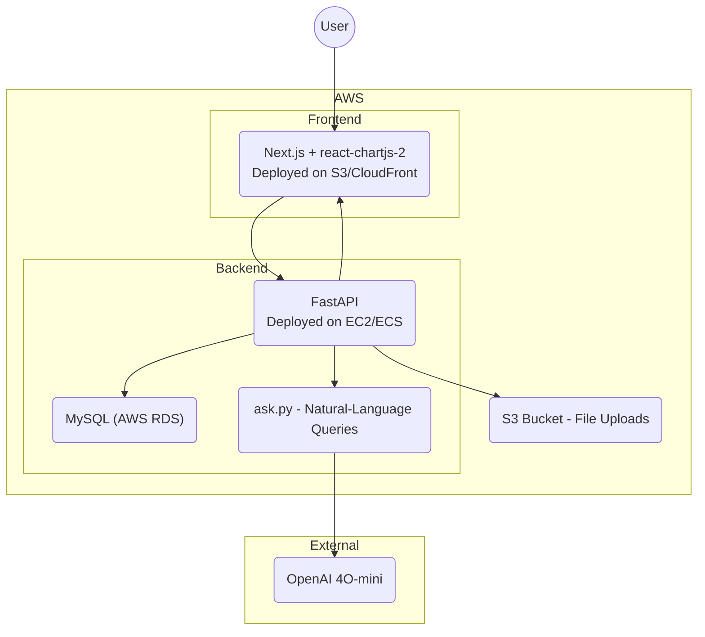

# AWS Cost Analyzer

[] []  

## Overview

AWS Cost Analyzer lets you upload billing reports (CSV/Excel/PDF), store and aggregate costs in a local MySQL database, then ask or CHAT with natural-language questions to gain insights and optimization suggestions using OpenAI’s GPT-3.5 Turbo.

## Tech Stack

- **Backend**: Python 3.x, FastAPI, Uvicorn, Pandas  
- **Database**: MySQL  
- **Frontend**: Next.js (React), Tailwind CSS  
- **LLM**: OpenAI GPT-3.5 Turbo
- **Charts**: Chart.js, react-chartjs-2  

## Architecture



## Features

- CSV, Excel, and PDF upload & parsing  
- Raw and aggregated storage (`cost_data`, `cost_summary`)  
- Natural-language Q&A → SQL → summarization  
- Interactive cost breakdown charts  

## Installation

```bash
git clone https://github.com/your-username/aws-cost-analyzer.git
```

Backend:

```bash
cd aws-cost-analyzer/backend
python3 -m venv venv
source venv/bin/activate
pip install -r requirements.txt
```

Frontend:

```bash
cd ../frontend
npm install
```

## Usage

Start Backend:

```bash
uvicorn backend.main:app --reload --host 0.0.0.0 --port 8000
```

Start Frontend:

```bash
npm --prefix frontend run dev
```

Open http://localhost:3000

## Configuration

Set environment variables in `.env` or your shell:

- `DB_HOST`, `DB_USER`, `DB_PASS`, `DB_NAME`  
- `OPENAI_API_KEY`

## Project Structure

```
.
├── backend
│   ├── main.py
│   ├── routes
│   │   ├── upload.py
│   │   └── ask.py
│   ├── db.py
│   └── requirements.txt
├── frontend
│   ├── pages
│   │   ├── index.tsx
│   │   ├── upload.tsx
│   │   └── ask.tsx
│   ├── components
│   │   └── CostChart.tsx
│   ├── styles
│   │   └── globals.css
│   ├── tailwind.config.js
│   └── package.json
└── README.md
```

## Contributing

Contributions are welcome. Please open issues or submit pull requests.

## License

MIT License
